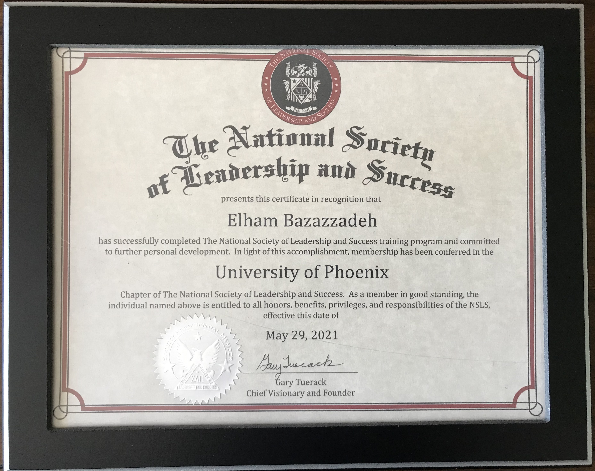
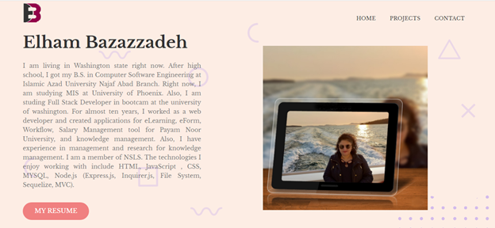
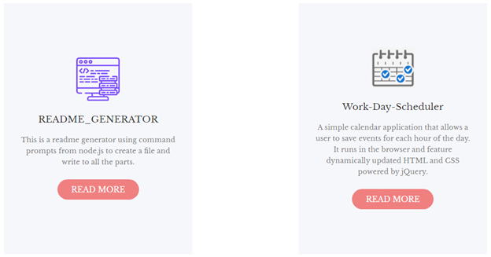
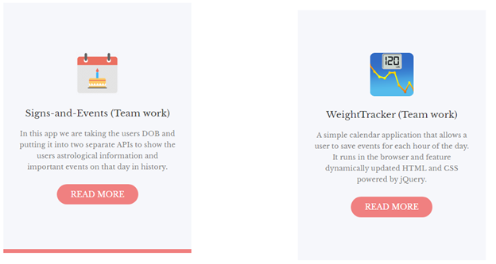

## My Portfolio

I am living in Washington state right now. After high school, I got my B.S. in Computer Software Engineering at Islamic Azad University Najaf Abad Branch. Right now, I am studying MIS at University of Phoenix. Also, I am studing Full Stack Developer in bootcam at the university of washington. For almost ten years, I worked as a web developer and created applications for eLearning, eForm, Workflow, Salary Management tool for Payam Noor University, and knowledge management. Also, I have experience in management and research for knowledge management. I am a member of NSLS. The technologies I enjoy working with include HTML, JavaScript , CSS, MYSQL, Node.js (Express.js, Inquirer.js, File System, Sequelize, MVC).

## My Resume

The Boeing Company- Assembler Wire Group B 21203		                                   Everett, WA. 04/2019-07/2020
•	Performed electrical tasks cutting/trimming wires, built wire bundles to connect electrical systems and built shelves and panel assemblies and applied sealant material to enclose electrical components and assemblies supporting Boeing aircrafts. 
•	Fabricated wire bundles with or without form boards to cut, code, count, sleeve, or splice wires and install various connectors, lugs, solder sleeves, ferrules, and contacts. Used handheld or machine crimping using lock stitches or Panduit straps required per drawing and Boeing specifications. 
•	Performed bond and ground tests, ensured electrical assemblies for installation of ground studs, and coordinated with Quality Assurance to inspect process checks and sealed around connections per specifications. 
•	Maintained an organized workspace as a priority for safety purpose using tool machines and hazardous materials and to control FOD. 

Amazon Fresh/FC Associate			                    Kent/Bellevue, WA. 11/2016-07/2019
Developed a safe working environment being on the Safety Committee. Accurately assembled 
customer orders and supported co-workers with problems. 
•	Collected items from the customers and collaborated with team members to ensure accurate inventory count. 

Appadana Pervasive Process Company-Management/Research			                   Isfahan, Iran 10/2007-12/2012
Executed production management tools and researched knowledge management.

Esfahan’s Mobarakeh Steel Company-Web Developer				           Esfahan-Mobarakeh, Iran 09/2006-09/2007
Used HTML, CSS, PHP, and MySQL Database to design web and created applications for research and development.

Elka Group Company-Web Developer				                                  Isfahan, Iran 07/2003-08/2006
Used HTML, CSS, PHP, and MySQL database developed web designs and created eLearning, 
eForm, WorkFlow, Salary Management Tools for Payam Noor University and supported 
software products as a customer technician.

## The NSLS Member
I am a member of the NSLS.

</img>

## My Website

</img>

## My Projects 

</img>

</img>

</img>
